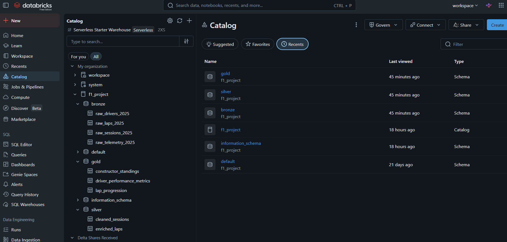
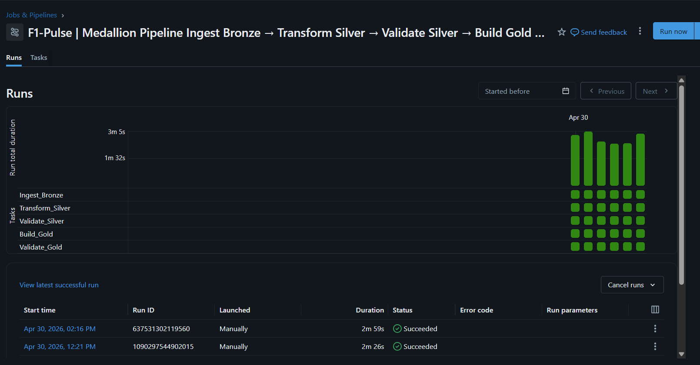
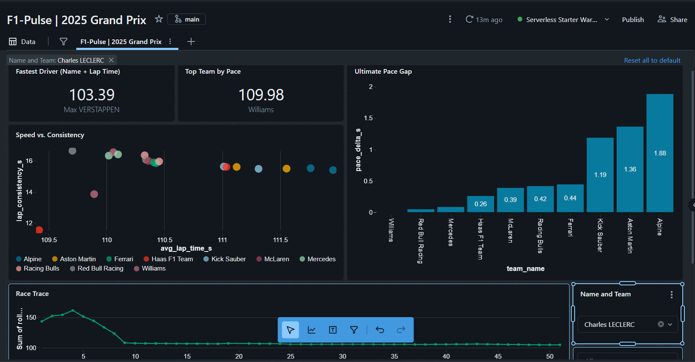

# 🏎️ F1-Pulse
### End-to-End Data Lakehouse — Automated F1 Telemetry & Performance Pipeline on Databricks

---

## 📋 Project Overview
F1-Pulse is a production-grade data engineering pipeline that ingests, transforms, and analyzes Formula 1 racing data using the Medallion Architecture (Bronze → Silver → Gold).

The pipeline pulls raw JSON responses from the OpenF1 REST API, processes them through three Delta Lake layers with automated data quality gates, and visualizes actionable driver and constructor insights in a Databricks SQL Dashboard. It is currently configured to process the 2025 Azerbaijan Grand Prix (Baku), but can be easily adapted to any race via configuration parameters.

⚠️ Note: All results are derived from OpenF1 telemetry data and represent analytical performance metrics, not official FIA race classifications.

---

## 🛠️ Tech Stack

| Layer | Technology |
|---|---|
| Platform | Databricks (Serverless Compute) |
| Language | Python (PySpark + Pandas) |
| Storage | Delta Lake (ACID transactions, Time Travel, Schema Enforcement) |
| Governance | Unity Catalog (3-layer namespace: `f1_project.bronze/silver/gold`) |
| Data Quality | Soda Core (`soda-core-spark-df`) — SodaCL checks at Silver and Gold |
| Orchestration | Databricks Workflows (5-task linear pipeline with DQ gates) |
| Testing | pytest (unit + integration tests across all modules) |
| Version Control | GitHub (integrated with Databricks Repos) |
| Data Source | OpenF1 REST API (free, real-time F1 telemetry) |
| **BI / Visualization**| Databricks SQL | Interactive dashboard powered by Gold tables |

---


## 🏗️ Architecture

```
OpenF1 REST API
      │
      ▼
┌─────────────────────────────────────────┐
│  BRONZE LAYER  (raw_sessions, raw_laps, │
│  raw_drivers, raw_telemetry)            │
│  • Retry-safe ingestion (3 attempts)    │
│  • Pandas middle-man for type safety    │
│  • ingested_at + source_url audit cols  │
└─────────────────┬───────────────────────┘
                  │
                  ▼
┌─────────────────────────────────────────┐
│  SILVER TRANSFORMATION                  │
│  (cleaned_sessions, enriched_laps)      │
│  • Schema drift detection               │
│  • Type casting                         │
│  • Driver deduplication before join     │
│  • is_valid_lap quality flag            │
└─────────────────┬───────────────────────┘
                  │
                  ▼
┌─────────────────────────────────────────┐
│  SILVER QUALITY GATE (Soda Core)        │
│  • Row count & freshness checks         │
│  • Primary key integrity                │
│  • Valid lap duration range             │
│  • Null checks on all key columns       │
└─────────────────┬───────────────────────┘
                  │
                  ▼
┌─────────────────────────────────────────┐
│  GOLD ANALYTICS                         │
│  (driver_performance,                   │
│  constructor_standings, lap_progression)│
│  • Window functions & rankings          │
│  • Lap consistency (std deviation)      │
│  • Rolling 5-lap average (time-series)  │
└─────────────────┬───────────────────────┘
                  │
                  ▼
┌─────────────────────────────────────────┐
│  GOLD QUALITY GATE (Soda Core)          │
│  • Rank integrity (starts at 1, unique) │
│  • Lap time sanity bounds               │
│  • Null checks on all metric columns    │
│  • Audit column population              │
└─────────────────────────────────────────┘
```
---


## ⚙️ Databricks Workflow

The pipeline runs as a 5-task Databricks job with linear dependencies.
A failed DQ gate raises an exception and halts all downstream tasks.

Ingest Bronze → Transform Silver → Validate Silver → Build Gold → Validate Gold



| Task | Notebook | Description |
|---|---|---|
| Ingest Bronze | `01_Bronze_Ingestion` | Retry-safe OpenF1 API ingestion |
| Transform Silver | `02_Silver_Transformation` | Schema validation, enrichment, quality flagging |
| Validate Silver | `03_Silver_Quality` | Soda DQ gate — halts pipeline on failure |
| Build Gold | `04_Gold_Analytics` | Leaderboard, constructor standings, lap progression |
| Validate Gold | `05_Gold_Quality` | Soda DQ gate — halts pipeline on failure |

> The Databricks Workflow definition is exported as JSON in `workflow/` —
> it can be imported directly into any Databricks workspace via
> Workflows → Create Job → Import.

---
---

## 🔬 Layer Details

### Bronze — Raw Ingestion (`01_Bronze_Ingestion`)
- Fetches Sessions, Laps, Drivers, and Telemetry from the OpenF1 API
- **Retry logic**: 3 attempts with 5s delay and 30s timeout per request — resilient to flaky free-tier APIs
- **Smart type handling**: only object/mixed columns are stringified; numeric types (lap times, speeds) are preserved natively
- **Safe session resolution**: filters by `session_type = Race` before selecting latest session key — no fragile `[-1]` index assumptions
- Audit columns: `ingested_at` timestamp + `source_url` on every table
- Idempotent: `overwrite` + `overwriteSchema` mode handles re-runs and schema evolution

### Silver — Cleaning & Enrichment (`02_Silver_Transformation`)
- **Schema drift guard**: `assert_columns()` validates expected fields exist before any transformation — catches API changes immediately
- **Proper type casting**: uses Spark's `IntegerType`, `FloatType`, `BooleanType` explicitly — no inference guesswork
- **Driver deduplication**: `dropDuplicates(["driver_number"])` before the join prevents row multiplication from multi-segment API responses
- **Quality flagging**: introduces `is_valid_lap` boolean column — flags pit-out laps and anomalous durations without dropping data, letting downstream layers decide
- Carries `country_code` and `headshot_url` forward for potential dashboard use

### Silver Quality Gate — (`03_Silver_Quality`)
- Runs **11 SodaCL checks** against `cleaned_sessions` and `enriched_laps`
- Validates: row counts, session type constraints, primary key uniqueness, null integrity, lap duration bounds, audit column population
- Raises exception on any failure — downstream Gold tasks are skipped automatically by Databricks Workflows

### Gold — Analytics (`04_Gold_Analytics`)
Produces **three purpose-built Delta tables** from a single Silver read:

| Table | Description |
|---|---|
| `driver_performance_metrics` | Per-driver leaderboard: fastest lap, avg pace, median pace, lap consistency (std dev), position rank |
| `constructor_standings` | Team-level summary: best lap, avg team pace, total laps, constructor rank |
| `lap_progression` | Lap-by-lap time series with rolling 5-lap average — ready for line charts |

### Gold Quality Gate — (`05_Gold_Quality`)
- Runs **30+ SodaCL checks** across all three Gold tables
- Validates: rank integrity, metric nulls, lap time sanity bounds, rolling average consistency, audit column population
- Raises exception on any failure — prevents corrupted Gold data from reaching dashboards

---
## 📦 Modules

All pipeline logic is encapsulated in reusable modules under `modules/`, 
keeping notebooks thin and logic testable in isolation.

| Module | Description |
|---|---|
| `api_client.py` | OpenF1 REST API client with retry logic |
| `f1_helpers.py` | Shared F1 domain helpers used across layers |
| `bronze_helpers.py` | Bronze ingestion helpers |
| `silver_helpers.py` | Silver layer helpers |
| `silver_transforms.py` | Silver transformation logic |
| `gold_helpers.py` | Gold layer helpers |
| `gold_transforms.py` | Gold analytics transformation logic |

---
## 🧪 Running Tests

Tests are executed directly from Databricks notebooks rather than the command line,
as the test suite requires a live Spark session and access to the workspace filesystem.

| Notebook | Description |
|---|---|
| `notebooks/utilities/Run_Unit_Tests` | Runs all unit tests across all modules |
| `notebooks/utilities/Run_Integration_Tests` | Runs integration tests against live Delta tables |

Run `00_Setup_Catalog` and at least one full pipeline pass before executing integration tests,
as they depend on the Silver and Gold tables existing in the metastore.

## 📈 Sample Results — 2025 Baku Grand Prix

### Driver Leaderboard
*Note: Pace Rank is calculated by taking into account Average Pace and Lap Consistency.*

| Rank | Driver | Team | No. | Fastest Lap (s) | Avg Pace (s) | Median Pace (s) | Consistency (σ) | Laps |
| :--- | :--- | :--- | :--- | :--- | :--- | :--- | :--- | :--- |
| 1 | Esteban OCON | Haas F1 Team | 31 | 105.388 | 109.418 | 107.070 | 11.523 | 49 |
| 2 | Max VERSTAPPEN | Red Bull Racing | 1 | 103.388 | 109.706 | 105.362 | 16.648 | 50 |
| 3 | Alexander ALBON | Williams | 23 | 104.152 | 109.894 | 105.861 | 13.846 | 49 |
| 4 | George RUSSELL | Mercedes | 63 | 103.754 | 110.020 | 105.377 | 16.329 | 50 |
| 5 | Carlos SAINZ | Williams | 55 | 103.972 | 110.060 | 105.791 | 16.553 | 50 |

### Constructor Standings
*Note: Constructor Rank is determined primarily by Average Team Pace across all valid laps.*

| Rank | Team | Best Lap (s) | Avg Team Pace (s) | Total Laps |
| :--- | :--- | :--- | :--- | :--- |
| 1 | Williams | 103.972 | 109.978 | 99 |
| 2 | Red Bull Racing | 103.388 | 110.024 | 100 |
| 3 | Mercedes | 103.754 | 110.060 | 100 |
| 4 | Haas F1 Team | 104.288 | 110.235 | 99 |
| 5 | McLaren | 104.155 | 110.364 | 50 |
---
## 📊 Databricks SQL Dashboard
The pipeline terminates in a Databricks SQL Dashboard, querying the Gold tables directly to provide race engineers and analysts with immediate visual insights. 




The dashboard is powered by the following live visualisations:

*   **Fastest Driver (KPI):** Queries `driver_performance_metrics` to display the driver with the absolute lowest `fastest_lap_s`.
*   **Top Team Pace (KPI):** Queries `constructor_standings` to find the team with the lowest `avg_team_pace_s`.
*   **Speed vs. Consistency (Scatter Plot):** Maps `avg_lap_time_s` (X-axis) against `lap_consistency_s` (Y-axis) from the driver leaderboard, identifying drivers who are both fast and reliably consistent.
*   **Ultimate Pace Gap (Bar Chart):** Uses a Common Table Expression (CTE) to calculate the `pace_delta_s` between the fastest constructor and the rest of the grid. 
*   **Race Trace (Line Chart):** Visualizes the `rolling_avg_5lap_s` from the `lap_progression` table over time, showing how driver pace evolves as fuel burns off and tire degradation sets in.
## 🚀 Key Engineering Features

- **Retry-safe ingestion**: configurable retries with delay and timeout — no silent failures on flaky APIs
- **Schema drift detection**: assertion guards at every layer boundary catch upstream API changes before they corrupt downstream tables
- **Data quality gates**: Soda Core checks at Silver and Gold boundaries — pipeline halts automatically on failure
- **Quality flagging over hard-dropping**: `is_valid_lap` preserves all data in Silver; Gold filters only when computing metrics
- **Window function analytics**: `dense_rank()` for leaderboards, `stddev()` for consistency scoring, rolling averages for time-series
- **Idempotent pipelines**: `overwrite` + `overwriteSchema` on all writes — re-runnable with no side effects
- **Structured logging**: timestamped log output with row counts and quality summaries at every step
- **Single source of truth config**: all environment constants (`CATALOG`, `SCHEMA`, `YEAR`, thresholds) centralised in `config/config.py` — referenced by notebooks, modules, and Soda checks alike
- **Separation of concerns**: code quality validated by pytest in CI/CD; data quality validated by Soda in the pipeline
- **Full orchestration**: end-to-end pipeline scheduled via Databricks Workflows with task-level dependency and failure handling

---

## 📂 Repository Structure
```
F1-Pulse/
├── notebooks/
│   ├── utilities/
│   │   ├── Run_Unit_Tests.py
│   │   └── Run_Integration_Tests.py
│   ├── 00_Setup_Catalog.py
│   ├── 01_Bronze_Ingestion.py
│   ├── 02_Silver_Transformation.py
│   ├── 03_Silver_Quality.py
│   ├── 04_Gold_Analytics.py
│   └── 05_Gold_Quality.py
├── modules/
│   ├── api_client.py
│   ├── bronze_helpers.py
│   ├── f1_helpers.py
│   ├── silver_helpers.py
│   ├── silver_transforms.py
│   ├── gold_helpers.py
│   └── gold_transforms.py
├── tests/
│   ├── unit_tests/
│   │   ├── conftest.py
│   │   ├── path_setup.py
│   │   ├── test_api_client.py
│   │   ├── test_bronze_helpers.py
│   │   ├── test_f1_helpers.py
│   │   ├── test_silver_helpers.py
│   │   ├── test_silver_transforms.py
│   │   ├── test_gold_helpers.py
│   │   └── test_gold_transforms.py
│   └── integration_tests/
│       ├── conftest.py
│       ├── test_integration_bronze_silver.py
│       └── test_integration_silver_gold.py
├── soda/
│   ├── checks_silver.yml
│   └── checks_gold.yml
├── config/
│   └── config.py
├── workflow/
│   └── F1-Pulse_Medallion_Pipeline.json
└── README.md
```

## 🔧 How to Run

1. Clone the repo and sync to your Databricks workspace via Repos
2. Run `00_Setup_Catalog.py` **once** to initialise the `f1_project` catalog and schemas
3. Trigger the **`F1-Pulse | Medallion Pipeline`** Databricks job for all subsequent runs
4. The job runs tasks in sequence — any DQ failure halts downstream tasks automatically

> No API key required — OpenF1 is a free, open REST API.

---

*Built with ❤️ for Formula 1 & Data Engineering*